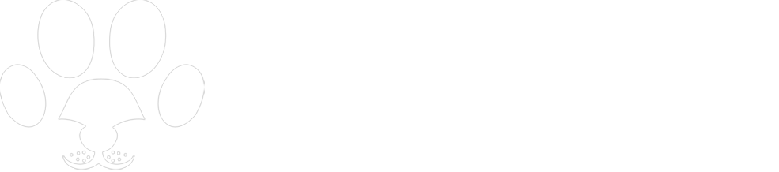
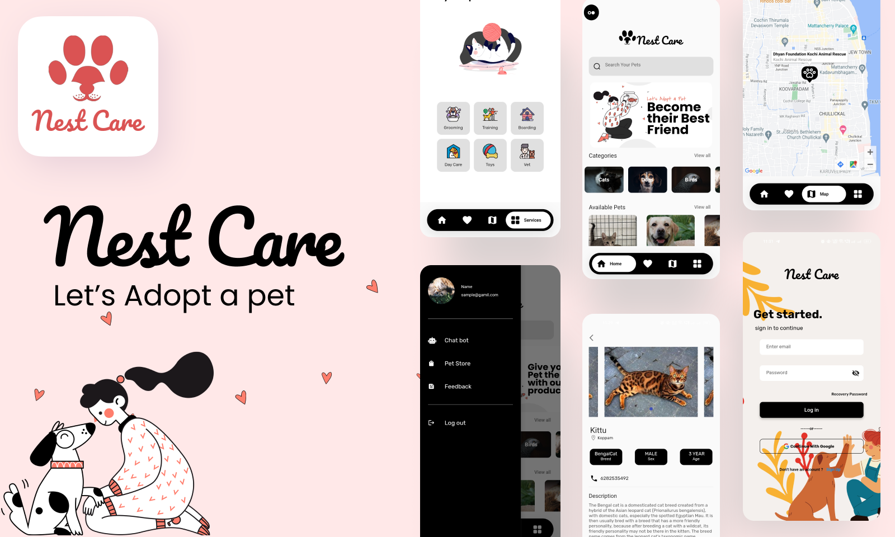
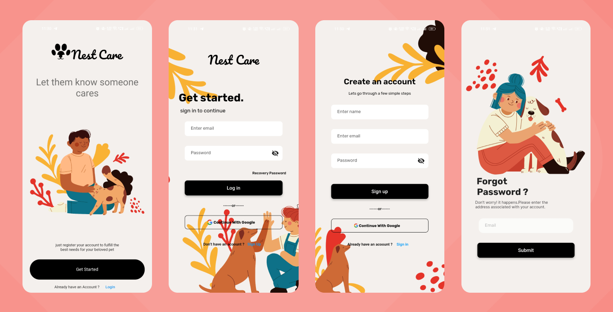
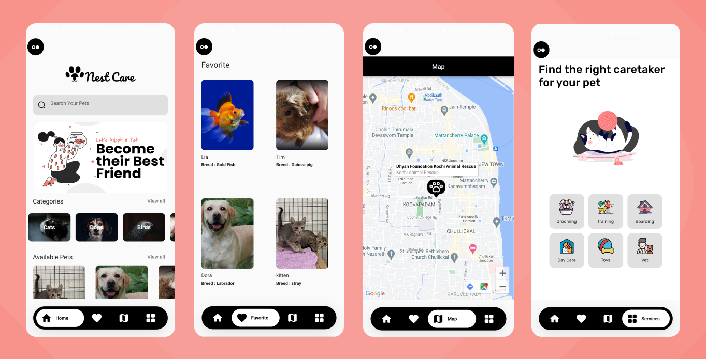
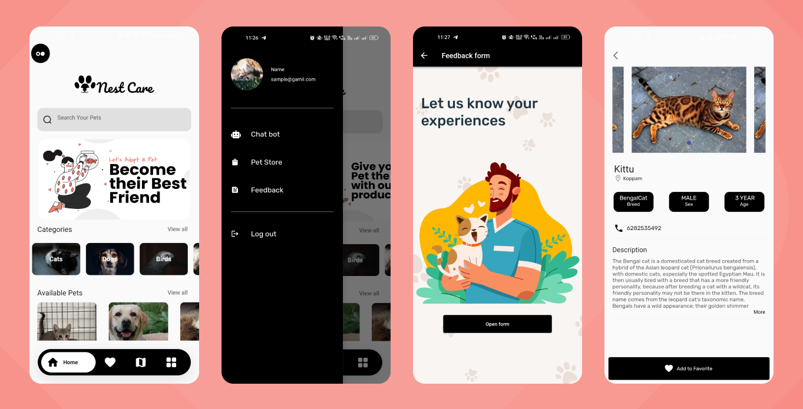

# Nest Care - Helping Pets Find Their Home

Welcome to the Nest Care Flutter App project! Nest Care is a mobile application designed to address the needs of abandoned and stray animals. In our fast-paced lives, we often overlook the little creatures in our neighborhoods, assuming their presence is routine and insignificant. Nest Care aims to change this by providing a solution to help these animals find new homes.

## Table of Contents
- [About Nest Care](#about-nest-care)
- [Features](#features)
- [Technologies](#technologies)
- [Getting Started](#getting-started)
- [Usage](#usage)
- [Screenshots](#screenshots)
- [Contributing](#contributing)
- [Download](#download)

## About Nest Care
In our busy lives, we never give a second thought to the little creatures wandering around our neighborhood. We consider it routine and nothing of significance. The ones at home are pretty clean, and vice-versa. So we decided to bring out a solution, which is to help them find their new home via our app. Throughout the app, you can find abandoned pets and rescued stray animals that are completely sterile and safe.

Using technology, we can connect you with our advanced medical bot, which is helpful for further doubts. Within the app, you're able to find a detailed version of vaccination, which is essential for them. We also provide doctor-recommended animal supplies that are pretty affordable.

Can't find someone to take care of your pets for a while? Don't worry! We have "pet sitting" - yes! you heard it right! As a new feature, we can find the right pet sitter in your nearest location. This application allows access to stray care organizations.

And that's not all! Nest Care also offers grooming, training, boarding, and a pet shop. Plus, we have another feature - we can map search the nearest vet center.

## Features

Nest Care offers the following features:

- **Abandoned Pets and Rescued Strays:** Browse profiles of abandoned pets and rescued stray animals that are safe and sterile, ready for adoption.

- **Medical Bot:** Get answers to your pet-related questions from our advanced medical bot, ensuring your pets receive the care they need.

- **Vaccination Records:** Access detailed vaccination information to keep your pets healthy and up-to-date on their shots.

- **Doctor-Recommended Supplies:** Find affordable, veterinarian-recommended animal supplies to ensure the well-being of your pets.

- **Pet Sitting:** Need someone to take care of your pets temporarily? Nest Care can help you find the right pet sitter in your nearest location.

- **Stray Care Organizations:** Connect with organizations dedicated to caring for stray animals and supporting their rehabilitation.

- **Grooming, Training, Boarding, and Pet Shop:** Explore a range of services and products to keep your pets happy and healthy.

- **Find Nearest Vet Center:** Quickly locate the nearest veterinary center for any emergencies or routine check-ups.

## Technologies
Nest Care is developed using the Dart programming language, which is used for the Flutter framework.

## Getting Started
To get started with Nest Care, follow these steps:

1. Clone the repository: `git clone https://github.com/yourusername/nest-care.git`
2. Install Flutter: [Flutter Installation Guide](https://flutter.dev/docs/get-started/install)
3. Run the app on your device or emulator: `flutter run`

## Usage

Use the Nest Care app to:

- Browse and adopt abandoned and rescued animals.
- Seek advice and information from the medical bot.
- Learn about pet vaccinations and supplies.
- Find a reliable pet sitter.
- Support stray care organizations.
- Access grooming, training, boarding, and pet shop services.
- Quickly locate the nearest vet center for your pet's needs.

## Screenshots

## Contributing

Contributions to Nest Care are welcome! If you have any ideas, bug fixes, or new features to contribute, please submit a pull request. Be sure to follow our code of conduct.

## Download

You can download the Nest Care app [here](https://drive.google.com/file/d/1oaNwHpfDzgsmWuE5genDMlrR0JROfyUk/view?usp=sharing).

You can download the Nest Care Presentation(pptx) [here](https://docs.google.com/presentation/d/1PkZI3Yv3TJTEm-HayFMjX2b0aCO1eM_J/edit?usp=sharing&ouid=104051497733581421040&rtpof=true&sd=true).

Thank you for using Nest Care and helping to make a difference in the lives of stray and abandoned animals!
